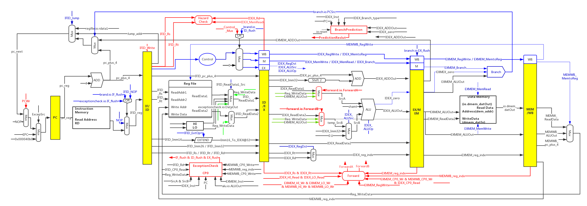
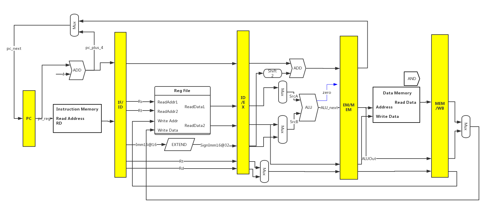
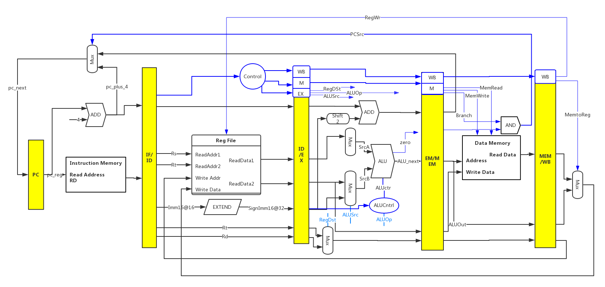
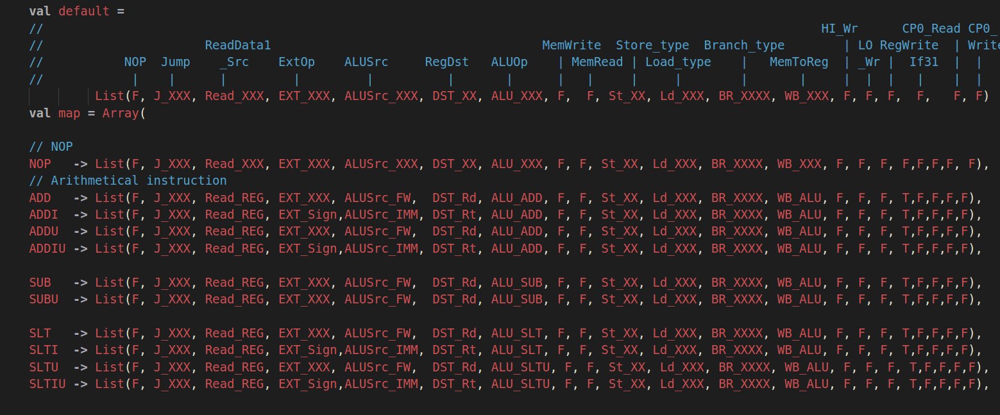
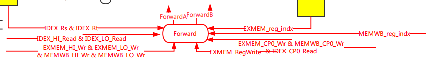
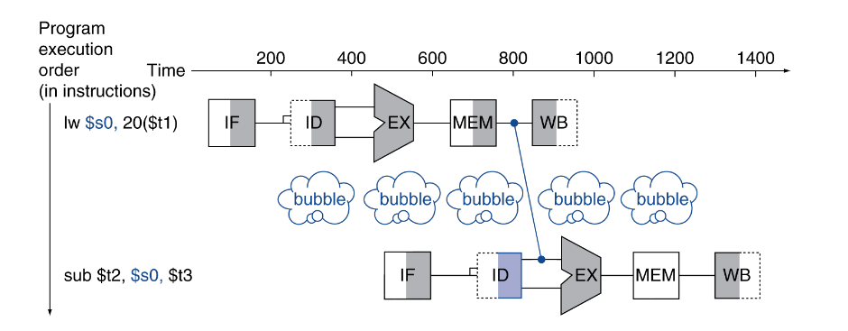
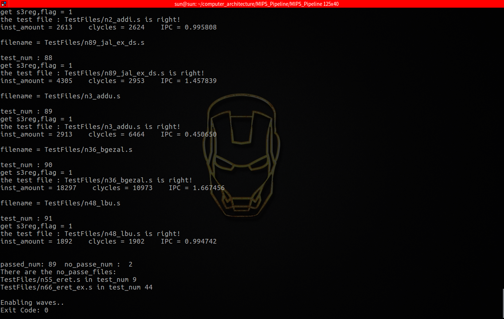
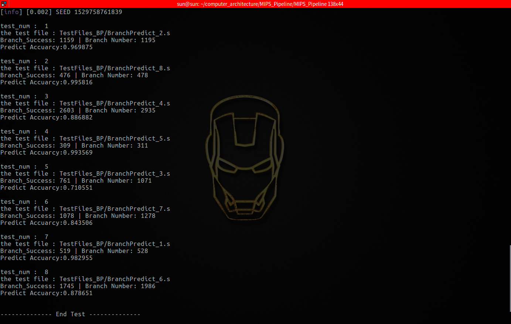

# MIPS-Pipeline-Branch Predict

本次设计的五级流水线分为以下几个阶段：

- IF：		取指令
- ID：        指令译码，读寄存器堆，冒险检测，例外检测
- EX：       执行或计算地址，旁路检测，分支预测
- MEM：  数据存储器的访问
- WB：     写回数据

目前实现的整体流程如下图所示，蓝色部分为控制通路，黑色部分为数据通路部分，红色绿色为旁路单元、冒险检测单元、分支预测单元、中断例外单元，因全部流程过于复杂，部分信号未画出，图中信号名称与代码中变量名称一致。




## 一、数据通路

设计数据通路部分时，在单周期时的数据通路上进行修改，增加了四个流水线寄存器，用来对信号进行存储和延时，以便于指令与数据随着执行过程从左到右依次执行通过五级流水线，简化版的流程图如下所示：



- IF：取指令：将PC中的指令读出，存放于IF/ID流水线存储器中以备后边使用，同时PC做PC+4处理，为读取下一条指令做准备
- ID：指令译码，读寄存器堆：将读取的指令信号进行译码，Rs、Rt、Rd和Imm16，同时也根据该译码来决定一些控制信号的值，根据信号类型，将数据从寄存器堆读出或者读出立即数，并将其存储入ID/EX流水线存储器，为后边做准备
- EX：执行或计算地址：读取由前译码部分传来的数据，通过ALU依指令进行操作得到ALUOut并存入下一级EX/MEM流水线存储器，以备后边使用
- MEM：数据存储器的访问：使用EX/MEM流水线寄存器中读取数据，并根据控制信号判断是否写回Memory
- WB：写回数据：五级流水线最后一个步骤，存MEM/WB流水线寄存器中读取数据，并写回RegFile寄存器堆

## 二、控制通路



简化版的控制通路如上如所示，控制通路并不能像单周期那样每次随指令改变立即改变，它需要随着译码指令按流水线逐级向下传递，以保证在每个流水级所收到的控制信号均是来自于该指令的译码。

```scala
// 部分控制信号如下所示，上图并没有完全体现，在最开始的完整图中有体现
	val Inst 		= Input(UInt(32.W))

	//*******PC & IF/ID*******//
	val NOP         	= Output(Bool())
	val Jump        	= Output(UInt(2.W))
	val ReadData1_Src  	= Output(UInt(2.W))   	
		// Choice of multiplication or division
	val ExtOp       	= Output(Bool())    	
		// Used for Control If Extend Sign

	//*******ID/EX*******//
	val ALUSrc      = Output(UInt(2.W))	
 	val RegDst      = Output(Bool())
    val ALUOp       = Output(UInt(5.W))

	//*******EX/MEM*******//
	val MemWrite	= Output(Bool())
	val MemRead		= Output(Bool())
	val Store_type  = Output(UInt(2.W))
	val Load_type   = Output(UInt(3.W))
    val Branch_type = Output(UInt(4.W))			
   
   //*******MEM/WB*******//
    val MemtoReg    = Output(UInt(2.W))
   	val HI_Wr     	= Output(Bool())
	val LO_Wr       = Output(Bool())
	val If31        = Output(Bool())
 	val RegWrite    = Output(Bool())
	val CP0_Read	= Output(Bool())
	val CP0_Write	= Output(Bool())
```

其中不同类型的指令，控制信号的值也各不相同，具体在代码的控制单元可以看到，流水线实现时对每条指令进行分析，选择合适的控制信号很为关键。

刚开始选择使用`when`来实现指令信号的控制，代码非常难以书写和查阅，后参考` riscv-sodor`中的`instruction`和`cpath`改为使用`BitPat 和 List`来实现对信号的控制，更为清晰明了。



## 三、旁路单元



如图中红色部分所示，为了维持流水线正常运行，添加旁路单元用于对寄存器进行数据前递旁入控制

- 当读取和写入的时间关系相反的时候，使用ForWardA和ForWardB对数据传入进行旁入
- 寄存器堆对一个地址同时读和写，读出的并不是最新的寄存器值，在满足该条件的情况下需要进行旁入
- 不仅仅是RegFile寄存器堆需要进行旁入，所以在之前的基础上，加入了更多的控制信号的，其中包括对HI和LO寄存器的控制和旁路、用于例外处理的CP0四个寄存器的控制和旁路

```scala
// 其中一条SrcA的旁路检测如下所示
when((io.MEMWB_RegWrite	
    && (io.MEMWB_reg_indx =/= 0.U) 
	&& ~(io.EXMEM_RegWrite && (io.EXMEM_reg_indx =/= 0.U)  && (io.EXMEM_RegWrite === io.IDEX_Rs))
	&& (io.MEMWB_reg_indx === io.IDEX_Rs))
	|| (io.MEMWB_HI_Wr  && (io.MEMWB_HI_Wr === io.IDEX_HI_Read))
	|| (io.MEMWB_LO_Wr  && (io.MEMWB_LO_Wr === io.IDEX_LO_Read))
	|| (io.MEMWB_CP0_Wr  && (io.MEMWB_CP0_Wr === io.IDEX_CP0_Read))){
		io.ForwardA := "b01".U(2.W)		
	}


	when((io.EXMEM_RegWrite 
    && (io.EXMEM_reg_indx =/= 0.U) 
    && (io.EXMEM_reg_indx === io.IDEX_Rs))
	|| (io.EXMEM_HI_Wr  && (io.EXMEM_HI_Wr === io.IDEX_HI_Read)// Used for HI Foward
	|| (io.EXMEM_LO_Wr  && (io.EXMEM_LO_Wr === io.IDEX_LO_Read)// Used for Lo Foward
	|| (io.EXMEM_CP0_Wr  && (io.EXMEM_CP0_Wr === io.IDEX_CP0_Read))){// Used for CP0 Foward
		io.ForwardA := "b10".U(2.W)		// forward --- EXMEM_ALUOut
	}

```


## 四、冒险阻塞单元

当一条指令试图读取由前一条装在指令读入的寄存器时，就无法使用旁路解决冒险。

```scala
if(IDEX_MemRead 
   && ((IDEX_Rt === IFID_Rs) || (IDEX_Rt === IFID_Rt)))
	stall the pipeline
```

`stall the pipeline`即延迟一个周期，可以是加一条`NOP`控制领来进行阻塞，将EX、MEM、WB级的控制信号都清除，同时也需要将IF/ID中已经取到了命令也置为空，防止下一条指令对流水线产生的影响。

- **注意：**`stall the pipeline` 不等于将指令置为0，而是加入一个气泡，下一个周期执行该条指令，如下图，产生气泡是根据指令`Instruction = sub `的时候，产生气泡如果清空该条指令，则相当于没有执行这一条指令，是错误的。

```scala
// 冒险检测部分核心代码如下
// stall the pipeline
when(io.IDEX_MemRead && ((io.IDEX_Rt === io.IFID_Rs) || (io.IDEX_Rt === io.IFID_Rt))){
		io.PCWr				:= false.B
		io.IFID_Write		:= false.B
		io.Control_Remove	:= true.B
}.otherwise{
		io.PCWr				:= true.B
		io.IFID_Write		:= true.B
		io.Control_Remove	:= false.B
}
```


## 五、中断例外单元

- 所有例外(含中断)的例外入口地址统一为 `0x000040b0`，对应第4141行，进入例外；
- 测试通过的标志指令为`26730001` ；
- 最后一条指令为`00934025`，如果测试未通过，会直接跳到这条指令；

|                   |       整型溢出例外       |     系统调用例外     |   断点例外    |  保留指令例外   |
| ----------------- | :----------------: | :------------: | :-------: | :-------: |
| Cause 的 ExcCode 域 |     0x0c (Ov)      |   0x08 (Sys)   | 0x09 (Bp) | 0x0a (RI) |
|                   | **地址错例外(读数据或取指令)** | **地址错例外(写数据)** |  **中断**   |           |
| Cause 的 ExcCode 域 |     0x04(AdEL)     |   0x05(AdEL)   | 0x00(Int) |           |

系统控制寄存器：

| Reg  | Sel  |  寄存器名称   |      功能定义       |
| :--: | :--: | :------: | :-------------: |
|  8   |  0   | BadVAddr | 记录最新地址相关例外的出错地址 |
|  12  |  0   |  Status  |   处理器状态与控制寄存器   |
|  13  |  0   |  Cause   |    存放上一次例外原因    |
|  14  |  0   |   EPC    | 存放上一次发生例外指令的 PC |

- BadVAddr 出错的虚地址，即` base + offset`的地址若出错(不是4的倍数或者不是2的倍数两种情况)则存下；
- Status 寄存器 当发生例外时候`EXL`即`Status(1)`置为1，`IE`即`Status(0)`置为0，表示屏蔽所有硬件和软件中断；当 `Status` 寄存器的` EXL `为 1 时,发生例外时不更新 EPC 寄存器；
- Cause 寄存器 存放上一次例外原因，ExcCode编码见上表，需要注意的是，当发生例外的指令处于延迟槽中的时候，Cause的BD位即`Cause(31)`需要置为1，其他情况为0；
- EPC 寄存器 存放例外处理完成后继续开始执行的指令的PC，在响应同步(精确)例外时,处理器向 EPC 寄存器中写入直接触发例外的指令的 PC，当放回处理时，选择的指令为`EPC+4`，即返回后继续运行发生例外的下一行；当直接触发的指令位于分支延迟槽的时候，则记录该指令前一条分支或跳转指令的 PC，同时 `Cause.BD`置为 1。

## 六、分支预测单元

- 当包含流水线技术的处理器处理分支指令时就会遇到一个问题，根据判定条件的真/假的不同，有可能会产生转跳，而这会打断流水线中指令的处理，因为处理器无法确定该指令的下一条指令，直到分支执行完毕。流水线越长，处理器等待的时间便越长，因为它必须等待分支指令处理完毕，才能确定下一条进入流水线的指令。

### 静态分支预测

最简单的静态分支预测方法就是任选一条分支。

- 认为branch一定会taken；
- 认为branch一定不会taken；这样平均命中率为50%。

单方向静态分支预测：总是预测条件跳转不发生，因此总是顺序取下一条指令执行，即总是`PC+4`

### 动态分支预测

- BHT——Branch History Table
- BTB——Branch Target Buffer


```scala
// 在代码中有如下定义
object StatusforBranchPrediction{
    def StrongNotTaken   = "b00".U(2.W)
    def WeaklyNotTaken   = "b01".U(2.W)
    def WeaklyTaken      = "b10".U(2.W)
    def StrongTaken      = "b11".U(2.W) 
}

// 以下状态机来进行状态的跳转
when(status_current  ===  StrongNotTaken){  
	status_next :=  Mux(Iftaken, WeaklyNotTaken,StrongNotTaken)
}.elsewhen(status_current  ===  WeaklyNotTaken){
	status_next :=  Mux(Iftaken, WeaklyTaken,StrongNotTaken)
}.elsewhen(status_current  === WeaklyTaken){
	status_next :=  Mux(Iftaken, StrongTaken,WeaklyNotTaken)
}.elsewhen(status_current  === StrongTaken){
	status_next :=  Mux(Iftaken, StrongTaken,WeaklyTaken)
}
```

当执行的到一个分支命令，分支被译码，对应的状态机被修改，若不采纳，则向“强不选择”方向降低状态值；如果分支被采纳，则向“强选择”方向提高状态值。这种方法的优点是，该条件分支指令必须连续选择某条分支两次，才能从强状态翻转，从而改变了预测的分支。

## 七、测试方式及测试结果

### 1、启动测试

```scala
// 在根目录下直接执行脚本文件即可以进行测试

1.流水线91条样例的测试
	./run-pipeline.bak.v.sh
2.分支预测8条样例正确率结果的测试
	./run-pipeline-bp.bak.v.sh
```

### 2、测试结果

- 流水线91条样例的测试结果如下图所示，其中91条样例通过89条，`eret 和 eret_ex`两条指令的测试并未通过




- 分支预测8条样例正确率结果的测试如下图所示，8条样例中两条为自己编写的测例，6条为性能测试中的样例，运行检测分支预测指令的正确，分支预测的正确率大部分情况下能够达到98%以上




