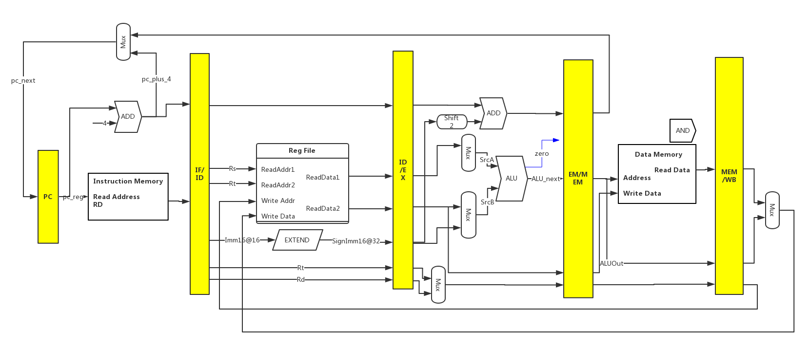
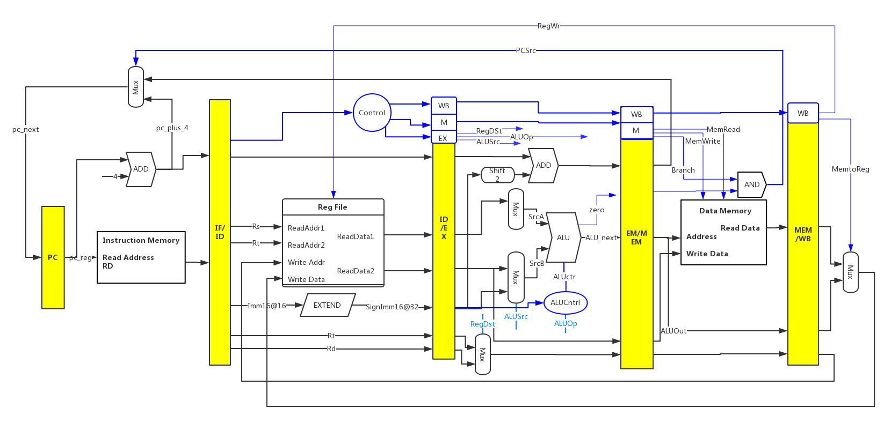

# MIPS-Pipeline处理器设计

本次设计的五级流水线分为以下几个阶段：

- IF：取指令
- ID：指令译码，读寄存器堆
- EX：执行或计算地址
- MEM：数据存储器的访问
- WB：写回数据

目前实现的整体流程如下图所示，蓝色部分为控制通路，黑色部分为数据通路部分，红色绿色为旁路单元和冒险检测单元，图中信号名称与代码中变量名称一致。


## 一、数据通路

设计数据通路部分时，在单周期时的数据通路上进行修改，增加了四个流水线寄存器，用来对信号进行存储和延时，以便于指令与数据随着执行过程从左到右依次执行通过五级流水线。



- IF：取指令：将PC中的指令读出，存放于IF/ID流水线存储器中以备后边使用，同时PC做PC+4处理，为读取下一条指令做准备
- ID：指令译码，读寄存器堆：将读取的指令信号进行译码，Rs、Rt、Rd和Imm16，同时也根据该译码来决定一些控制信号的值，根据信号类型，将数据从寄存器堆读出或者读出立即数，并将其存储入ID/EX流水线存储器，为后边做准备
- EX：执行或计算地址：读取由前译码部分传来的数据，通过ALU依指令进行操作得到ALUOut并存入下一级EX/MEM流水线存储器，以备后边使用
- MEM：数据存储器的访问：使用EX/MEM流水线寄存器中读取数据，并根据控制信号判断是否写回Memory
- WB：写回数据：五级流水线最后一个步骤，存MEM/WB流水线寄存器中读取数据，并写回RegFile寄存器堆

## 二、控制通路



控制通路并不能像单周期那样每次随指令改变立即改变，它需要随着译码指令按流水线逐级向下传递，以保证在每个流水级所收到的控制信号均是来自于该指令的译码。

```scala
	// 部分控制信号如下所示，有些上图并没有体现但是在最开始的完整图中有体现
	val boot		= Input(Bool())
	val stall		= Input(Bool())

	//*******旁路单元******//
	val forwardA	= Input(UInt(2.W))
	val forwardB	= Input(UInt(2.W))
    val ForwardA	= Output(UInt(2.W))
	val ForwardB	= Output(UInt(2.W))

	//*******IF/ID*******//
	val Rd 			= Output(UInt(5.W))
	val Rt 			= Output(UInt(5.W))
	val Rs 			= Output(UInt(5.W))
	val Imm16 		= Output(UInt(16.W))
	val	Imm26		= Output(UInt(26.W))	
	val IRWr 		= Output(Bool())

	//*******ID/EX*******//
	val ALUSrc      = Output(Bool())
 	val RegDst      = Output(Bool())
    val ALUOp       = Output(UInt(5.W))

	//*******EX/MEM*******//
    val Branch    	= Output(Bool())
	val PCSrc       = Output(Bool())
	val MemRead		= Output(Bool())
	val MemWrite	= Output(Bool())
   
   //*******MEM/WB*******//
    val MemtoReg    = Output(Bool())
	val RegWrite    = Output(Bool())

	val PCWr        = Output(Bool())

   //*******Used for Jump*******//
	val IFJump      = Output(Bool())
	val IFRemove    = Output(Bool())
	val beq_zero 	= Input(Bool())
	val Beq_zero 	= Output(Bool())

   //*******Used for Control If Extend Sign*******//
	val ExtOp       = Output(Bool())

   //******* To Contrl io.MemWrite *******//
	val MemWrite_In	= Input(Bool())

```

| 信号名      | False(0)时含义          | True(1)时含义               |
| -------- | -------------------- | ------------------------ |
| ALUSrc   | ALU第二个操作数来自ReadData2 | ALU第二个操作数来自Imm16         |
| RegDst   | 写入寄存器的目标号来自Rt        | 写入寄存器的目标号来自Rd            |
| PCSrc    | PC被PC+4取代            | PC被分支目标地址取代              |
| MemRead  | 不从DataMemory读取       | 输入地址对应的数据存储器的内容为读数据的输出   |
| MemWrite | 不写入DataMemory        | 输入地址对应的数据存储器的内容替换为写数据的输入 |
| MemtoReg | ALU提供寄存器写数据的输入       | 数据存储器提供寄存器写数据的输入         |
| RegWrite | 寄存器堆的写使能-不允许写入       | RegFile寄存器堆的写使能-允许写入     |
| PCWr     | 插入NOP指令              | pc读取下一个数据                |
| IFJump   | pc = pc + 4          | pc = 计算出的ADDOut单元        |
| IFRemove | IF/ID流水线寄存器正常读取      | IF/ID流水线寄存器清空插入NOP       |

其中不同类型的指令，控制信号的值也各不相同，具体在代码的控制单元可以看到，流水线实现时对每条指令进行分析，选择合适的控制信号很为关键。

## 三、旁路单元


如图中红色部分所示，为了维持流水线正常运行，添加了三个部分的旁路单元：

- 当读取和写入的时间关系相反的时候，使用ForWardA和ForWardB对数据传入进行旁入
- 寄存器堆对一个地址同时读和写，读出的并不是最新的寄存器值，在满足该条件的情况下需要进行旁入
- 在sw写回DataMemory的时候，需要提前对RegFile进行写入

```scala
//ForWardA & ForWardB 对　Alu操作数的选择
	SrcA :=	MuxCase(ReadData1, Array(
					(io.ctl.ForwardA === 0.U(2.W)) -> IDEX_ReadData1,
					(io.ctl.ForwardA === 1.U(2.W)) -> Reg_WriteData,
					(io.ctl.ForwardA === 2.U(2.W)) -> EXMEM_ALUOut
					))
	SrcB := Mux(IDEX_ALUSrc, IDEX_SingnImm16,
					MuxCase(ReadData2, Array(
					(io.ctl.ForwardB === 0.U(2.W)) -> IDEX_ReadData2,
					(io.ctl.ForwardB === 1.U(2.W)) -> Reg_WriteData,
					(io.ctl.ForwardB === 2.U(2.W)) -> EXMEM_ALUOut
					)))
```


```scala
	// 三个旁路单元的实现
	// ForwardA
	when(EXMEM_RegWrite && (EXMEM_reg_indx =/= 0.U) &&(EXMEM_reg_indx === IDEX_Rs)){
		io.ctl.forwardA := "b10".U(2.W)
	}
	when(MEMWB_RegWrite	&& (MEMWB_reg_indx =/= 0.U) 
	&& (EXMEM_RegWrite && (EXMEM_reg_indx =/= 0.U)  && (EXMEM_RegWrite =/= IDEX_Rs))
	&& (MEMWB_reg_indx === IDEX_Rs)){
		io.ctl.forwardA := "b01".U(2.W)//1.U(2.W)) -> io.dmem_datIn,
	}.otherwise{
		io.ctl.forwardA := "b00".U(2.W)//0.U(2.W)) -> ReadData1
	}

	// ForwardB
	when(EXMEM_RegWrite && (EXMEM_reg_indx =/= 0.U) &&(EXMEM_reg_indx === IDEX_Rt)){
		io.ctl.forwardB := "b10".U(2.W)
	}
	when(MEMWB_RegWrite && (MEMWB_reg_indx =/= 0.U) 
	&& (EXMEM_RegWrite && (EXMEM_reg_indx =/= 0.U)  && (EXMEM_RegWrite =/= IDEX_Rt))
	&& (MEMWB_reg_indx === IDEX_Rt)){
		io.ctl.forwardB := "b01".U(2.W)//1.U(2.W)) -> io.dmem_datIn,
	}.otherwise{
		io.ctl.forwardB := "b00".U(2.W)//0.U(2.W)) -> ReadData2
	}

	// Used for RegFile When Read and Write at same time
	when(MEMWB_RegWrite && io.ctl.Rs === MEMWB_reg_indx){
		ReadData1 := Reg_WriteData
	}
	when(MEMWB_RegWrite && io.ctl.Rt === MEMWB_reg_indx){
		ReadData2 := Reg_WriteData
	}

	// Used for Sw
	when (MEMWB_RegWrite === true.B) {
		RegFile(MEMWB_reg_indx) := Reg_WriteData
	}	
```


## 四、冒险阻塞单元

当一条指令师徒读取由前一条装在指令读入的寄存器时，就无法使用旁路解决冒险。

```scala
if(IDEX_MemRead 
   && ((IDEX_Rt === IFID_Rs) || (IDEX_Rt === IFID_Rt)))
	stall the pipeline
```

`stall the pipeline`即延迟一个周期，可以是加一条`NOP`控制领来进行阻塞，将EX、MEM、WB级的控制信号都清除，同时也需要将IF/ID中已经取到了命令也置为空，防止下一条指令对流水线产生的影响

## 五、测试方式及测试结果

### 启动测试

```scala
//有两种运行测试样例的方式				可生成波形仿真
//在目录下运行sbt，输入测试命令进行测试
sbt
test:runMain Pipeline.Launcher Top --backend-name verilator

//或者在根目录下直接执行脚本文件
./run-pipeline.sh
```

### 测试结果

对文件inst.s进行测试，运行结果如下图，其中四个寄存器中地址均正确，三个Memory中的数据也均正确


同时在`test_run_dir/examples/Top`文件中生成Verilog文件，其中的`Top.vcd`可以通过Gtkwave进行波形仿真，添加希望看到的信号即可进行观察，如下图所示(可修改颜色便于观察)，通过波形图观察，可以很直观的观察到流水线的“流动”


### inst.s中指令翻译

```scala
// 0x00000000 00000000 
// 0x00000001 34090001 ori	$t1, $zero, 1
// 0x00000002 341107d0 ori 	$s1, $zero, 2000
// 0x00000003 341207d4 ori 	$s2, $zero, 2004
// 0x00000004 02298820 add	$s1, $s1, $t1
// 0x00000005 ac090000 sw 	$t1, 0($zero)
// 0x00000006 ac110004 sw	$s1, 4($zero)
// 0x00000007 ac120008 sw	$s2, 8($zero)
// 0x00000008 12320001 beq	$s1, $s2, 1
// 0x00000009 08000001 j	1    // 0000 0100 0000 0000 0000 0000 0000 0001
// 0x0000000a 00000000
// 0x0000000b 00000000

3c040100    =   0011 11  00000  00100  0000 0001 0000 0000
				LUI			5	rt		imm
				将 16 位立即数 imm 写入寄存器 rt 的高 16 位,寄存器 rt 的低 16 位置 0。
				GPR[rt] ← (imm || 0 16 )	

34090001    =   0011 01  00000  01001  0000 0000 0000 0001 
                OriExec  Rs     Rt     immediate(16)
                GPR[rt] GPR[rs] OR immediate
                $Rt = $Rs | Immediate
                所以最后结果中 寄存器 9 中的数据应该为1

341107d0    =   0011 01  00000  10001  0000 0111 1101 0000
                OriExec  Rs     Rt     immediate(16)
                $Rt = $Rs | Immediate
                所以最后结果中 寄存器 17 中的数据应该为2000

341207d4    =   0011 01  00000  10010  0000 0111 1101 0100
                OriExec  Rs     Rt     immediate(16)
                $Rt = $Rs | Immediate
                所以最后结果中 寄存器 18 中的数据应该为2004

02298820    =   0000 00  10001 01001 10001  000 00  10 0000
                RExec    Rt    Rs    Rd             Add
                GPR[rd] <- GPR[rs]+GPR[rt]
                所以最后结果中 寄存器 17 中数据 = 寄存器 9 中数据 + 寄存器 17 中数据 = 2001

ac090000    =   1010 11  00000  01001  0000 0000 0000 0000   lw or sw
AdrCal          sw       base   Rt     offset
                sw $v1, 8($s0)  把$Rt存储到 以Base为起始地址 偏移量为offset的位置

                memory[GPR[base]+offset] <- GPR[rt]
                将寄存器 9 中的数据写入到Memory

ac110004    =   1010 11  00000  10001  0000 0000 0000 0100
AdrCal          sw       base   Rt     offset
                memory[GPR[base]+offset] <- GPR[rt]
                sw $v1, 8($s0)  把$Rt存储到 以Base为起始地址 偏移量为offset的位置

                将寄存器 17 中的数据写入到Memory

ac120008    =   1010 11  00000  10010  0000 0000 0000 1000
AdrCal          sw       base   Rt     offset
                memory[GPR[base]+offset] <- GPR[rt]
                sw $v1, 8($s0)  把$Rt存储到 以Base为起始地址 偏移量为offset的位置
                将寄存器 18 中的数据写入到Memory

12320001    =   0001 00  10001  10010  0000 0000 0000 0001
BrComplete      BEQ      Rs     Rt     offset
相等时跳转        if (GPR[rs] == GPR[rt])
					PC <- PC + 4 + sign_extend(offset 0 2 )
				else
					PC <- PC + 4
                如果寄存器 17 和 18 的值相等 跳转到第一个   -> 到了0x0000000a

08000004    =   0000 10  00000  00000  0000 0000 0000 0100
                jump     instr_index
                跳转		PC ← PC 31..28 || instr_index || 00

```

